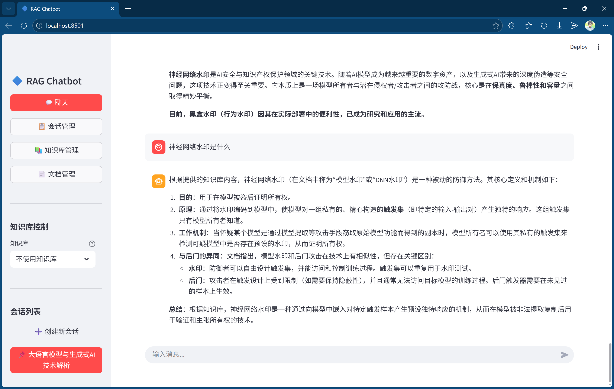
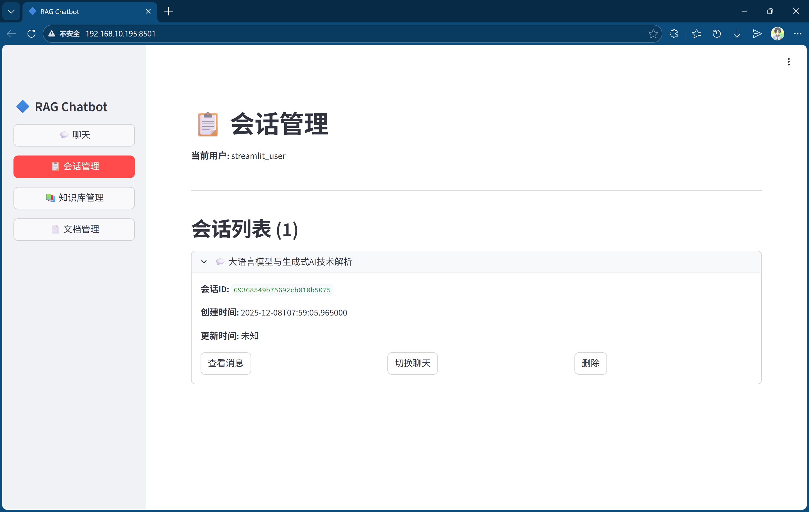
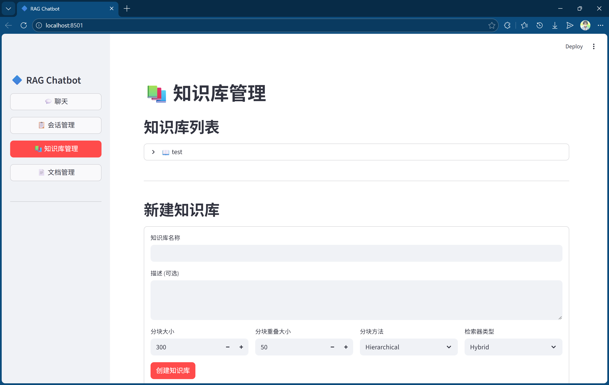
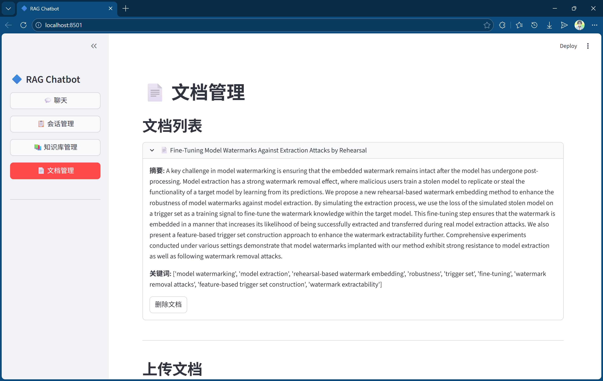
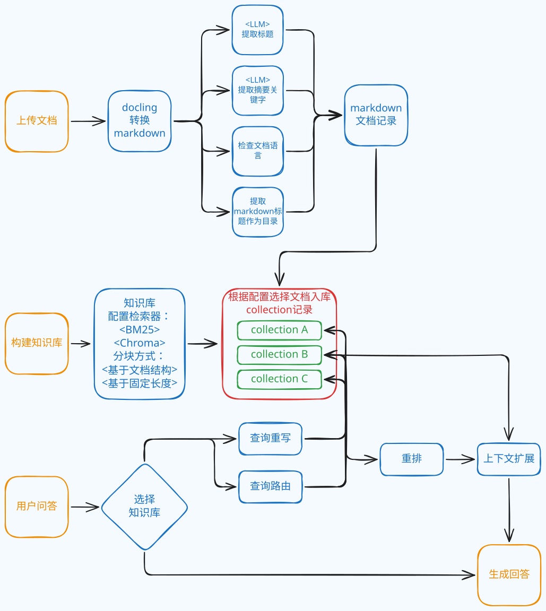

# RAG Agent v2

一个基于 RAG（检索增强生成）技术的智能对话系统，支持文档知识库管理、多种检索策略和长期记忆功能。

<div style="display: flex; gap: 10px; justify-content: center;">
  
  
  
  
</div>

## 🌟 主要特性

- **文档知识库管理**：支持多种文档格式上传、解析和管理
- **多种检索策略**：
  - 向量检索（Vector）
  - 稀疏检索（Sparse/BM25）
  - 混合检索（Hybrid）
- **智能对话**：
  - 查询重写（Query Rewrite）
  - 查询路由（Query Route）
  - 重排序（Rerank）
  - 上下文检索（Context Retrieve）
- **会话管理**：支持多会话管理和长期记忆
- **文档解析**：基于 Docling 的高质量文档解析
- **多模型支持**：支持多种 LLM 和 Embedding 模型

## 📋 技术栈

- **后端框架**：FastAPI + Uvicorn
- **数据库**：MongoDB + ChromaDB
- **文档处理**：Docling
- **LLM 集成**：OpenAI、DeepSeek、Bailian 等
- **前端界面**：Streamlit

## 🛠️ 安装

### 环境要求

- Python >= 3.11
- MongoDB
- ChromaDB

## ⚙️ 配置

主要配置文件为 `pyproject.toml`，包含以下配置项：

### MongoDB 配置

```toml
[tool.mongo]
uri = "mongodb://localhost:27017"
db_name = "rag_agent_v2_database"
```

### ChromaDB 配置

```toml
[tool.chroma]
persist_directory = "data/chroma_db"
# 可选：远程 ChromaDB 服务
# host = "localhost"
# port = 8000
```

### 对话模型配置

```toml
[tool.dialog]
llm_provider = "deepseek"
llm_model = "deepseek-chat"
```

### RAG 配置

```toml
[tool.rag]
# 检索器类型
retriever_type = "hybrid"  # vector, sparse, hybrid

# 文档上传
file_storage_dir = "data/stored_files"
max_file_size_mb = 10

# 文档解析
markdown_storage_dir = "data/markdown_files"
chunk_dir = "data/chunked_files"
chunk_size = 300
chunk_overlap = 50
split_method = "hierarchical"  # character, recursive, hierarchical

# 模型配置
llm_provider = "deepseek"
llm_model = "deepseek-chat"
embedding_provider = "bailian"
embedding_model = "text-embedding-ada-002"

# 检索配置
top_k = 5
query_rewrite = true
query_route = true
rerank = true
context_retrieve = true
```

### 记忆配置

```toml
[tool.memory]
split_method = "character"
max_chunk_size = 300
retriever_type = "vector"
top_k = 5
min_similarity_score = 0.75
chunk_dir = "data/chunked_memory"
```

## 🚀 快速开始

### 1. 启动 MongoDB

确保 MongoDB 服务已启动：

```bash
# Windows
net start MongoDB

# Linux/macOS
sudo systemctl start mongod
```

### 2. 启动 FastAPI 服务器

```bash
uvicorn src.api.main:app --reload --host 0.0.0.0 --port 8000
```

服务将在 `http://localhost:8000` 启动。

API 文档：

- Swagger UI: `http://localhost:8000/docs`
- ReDoc: `http://localhost:8000/redoc`

### 3. 启动 Streamlit 前端界面

```bash
streamlit run streamlit_demo.py
```

前端界面将在浏览器自动打开（默认 `http://localhost:8501`）。

## 📑RAG 流程图



## 📁 项目结构

```text
rag-agent-v2/
├── config.py                 # 配置加载
├── pyproject.toml            # 项目配置和依赖
├── streamlit_demo.py         # Streamlit 前端界面
├── data/                     # 数据目录
│   ├── chroma_db/            # ChromaDB 持久化目录
│   ├── stored_files/         # 上传文件存储
│   ├── markdown_files/       # 解析后的 Markdown 文件
│   ├── chunked_files/        # 文档分块存储
│   └── chunked_memory/       # 记忆分块存储
├── docs/                     # 文档
└── src/                      # 源代码
    ├── api/                  # FastAPI 路由和模型
    │   ├── main.py           # 主应用入口
    │   ├── models.py         # API 数据模型
    │   ├── dependencies.py   # 依赖注入
    │   └── routers/          # API 路由
    │       ├── chat.py       # 聊天接口
    │       ├── document.py   # 文档管理
    │       └── knowledge_base.py  # 知识库管理
    ├── database/             # 数据库层
    │   ├── chroma/           # ChromaDB 封装
    │   └── mongo/            # MongoDB 封装
    ├── document/             # 文档处理
    │   ├── parse.py          # 文档解析
    │   └── document_service.py  # 文档服务
    ├── embedding/            # Embedding 模型
    │   ├── factory.py        # 模型工厂
    │   └── adapter/          # 各种 Embedding 适配器
    ├── llm/                  # LLM 模型
    │   ├── factory.py        # 模型工厂
    │   ├── Message.py        # 消息类型
    │   └── adapter/          # 各种 LLM 适配器
    ├── prompt/               # 提示词管理
    │   ├── get_prompt.py     # 提示词获取
    │   ├── llm_call.py       # LLM 调用封装
    │   ├── PromptConfig.py   # 提示词注册类
    │   ├── auto_register.py  # 提示词注册方法
    │   └── module            # 不同模块的prompt模板，以及注册
    ├── rag/                  # RAG 核心模块
    │   ├── ingest/           # 文档摄取
    │   ├── knowledge_base/   # 知识库管理
    │   ├── retriever/        # 检索器
    │   └── retrieve_pipeline/  # 检索流程
    └── session/              # 会话管理
        ├── SessionService.py # 会话服务
        ├── dialog/           # 对话管理
        └── memory/           # 记忆管理
```

## 🔌 API 接口

### 会话管理

- `POST /api/v1/sessions` - 创建新会话
- `GET /api/v1/sessions/{session_id}` - 获取会话信息
- `POST /api/v1/sessions/{session_id}/exit` - 结束会话
- `GET /api/v1/sessions/user/{user_id}` - 获取用户所有会话

### 聊天接口

- `POST /api/v1/chat` - 发送聊天消息
- `POST /api/v1/chat/stream` - 流式聊天（SSE）

### 知识库管理

- `POST /api/v1/knowledge-bases` - 创建知识库
- `GET /api/v1/knowledge-bases` - 获取所有知识库
- `GET /api/v1/knowledge-bases/{kb_id}` - 获取知识库详情
- `DELETE /api/v1/knowledge-bases/{kb_id}` - 删除知识库

### 文档管理

- `POST /api/v1/documents/upload` - 上传文档
- `GET /api/v1/documents` - 获取所有文档
- `GET /api/v1/documents/{doc_id}` - 获取文档详情
- `DELETE /api/v1/documents/{doc_id}` - 删除文档

## 🤖 支持的模型

### LLM 模型

- OpenAI (GPT-3.5, GPT-4)
- DeepSeek
- Anthropic Claude
- Bailian（阿里云百炼）
- 等更多...

### Embedding 模型

- OpenAI Embeddings
- Bailian Embeddings
- 等更多...

## 🔧 开发

### 添加新的 LLM 适配器

在 `src/llm/adapter/` 目录下创建新的适配器类，继承 `BaseChatAdapter`：

```python
from src.llm.adapter.BaseChatAdapter import BaseChatAdapter

class MyCustomChatAdapter(BaseChatAdapter):
    def __init__(self, model: str = "custom-model", **kwargs):
        super().__init__(model, **kwargs)
        # 初始化自定义模型
    
    def chat(self, messages, **kwargs):
        # 实现聊天逻辑
        pass
```

### 添加新的 Embedding 适配器

在 `src/embedding/adapter/` 目录下创建新的适配器类，继承 `BaseEmbeddingAdapter`：

```python
from src.embedding.adapter.BaseEmbeddingAdapter import BaseEmbeddingAdapter

class MyCustomEmbeddingAdapter(BaseEmbeddingAdapter):
    def embed_documents(self, texts):
        # 实现文档嵌入逻辑
        pass
    
    def embed_query(self, text):
        # 实现查询嵌入逻辑
        pass
```

### 添加分块算法

TODO

### 添加 retrieve pipeline

TODO

### 添加 prompt 以及 LLM 调用

TODO

## 📝 许可证

本项目使用 MIT 许可证。

## 👥 作者

**Kyleidoscopist**  
Email: <1053503073@qq.com>

## 🤝 贡献

欢迎提交 Issue 和 Pull Request！

## 📮 联系方式

如有问题或建议，请通过以下方式联系：

- 提交 GitHub Issue
- 发送邮件至：<1053503073@qq.com>

---

⭐ 如果这个项目对你有帮助，欢迎 Star！
